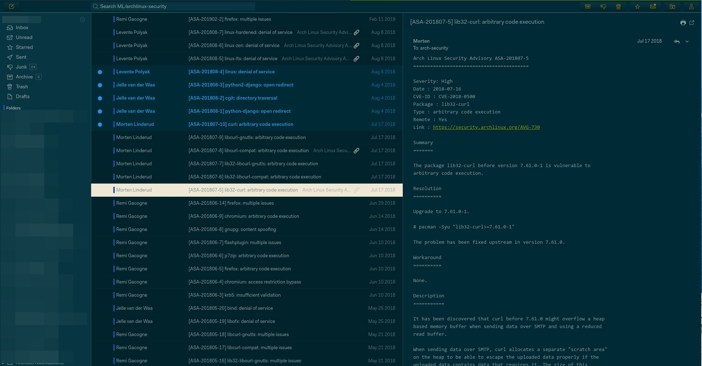

# Mailspring Solarized Dark Theme



## Note

It currently doesn't look very good.

## Setup

1. Download and extract this repository somewhere
2. Open Mailspring and install the theme by going to `Mailspring > Install New Theme...` and selecting the directory.
3. Change the theme in `Mailspring > Change Theme`

Based on [Mailspring-Theme-Starter](https://github.com/Foundry376/Mailspring-Theme-Starter)

## Structure

```
.
├── styles                 # All stylesheets
|   ├── index.less             # Main LESS file to import your stylesheets
│   ├── ui-variables.less  # UI variables that override N1's defaults
│   ├── theme-colors.less  # Theme colors for theme preview (optional)
├── package.json           # Metadata about the theme
├── LICENSE.md             # License with usage rights
└── README.md              # Info about your theme and how to use it
```

## License

Licensed under the [MIT License](https://nemo.mit-license.org/). See LICENSE file for details.

## Credits

All colors based on [upstream solarized](https://github.com/altercation/solarized).